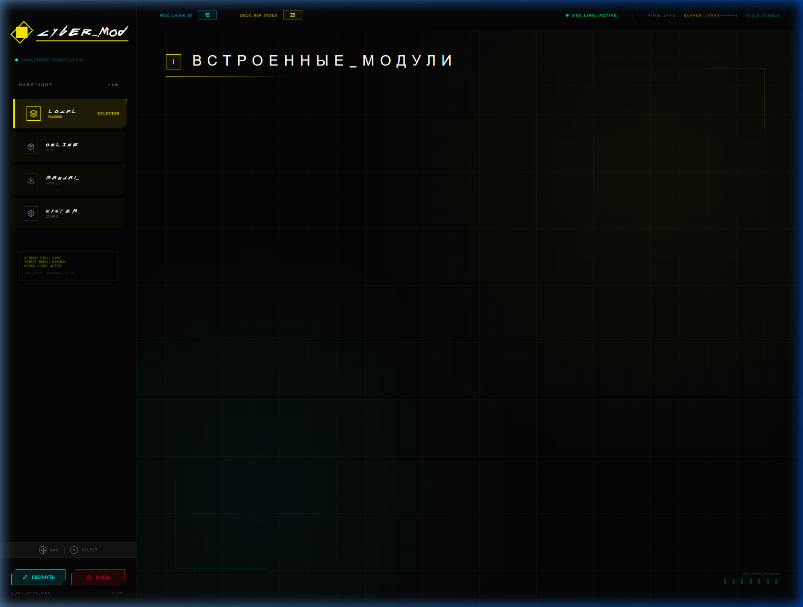
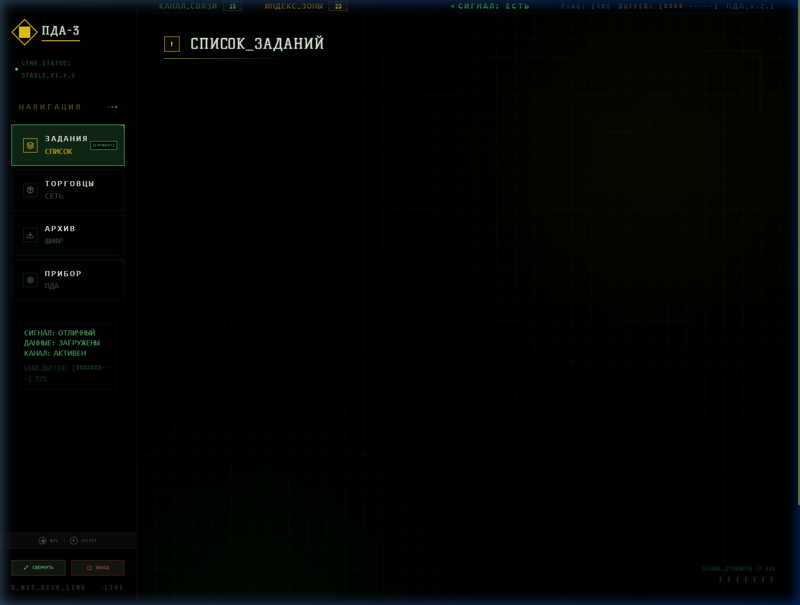
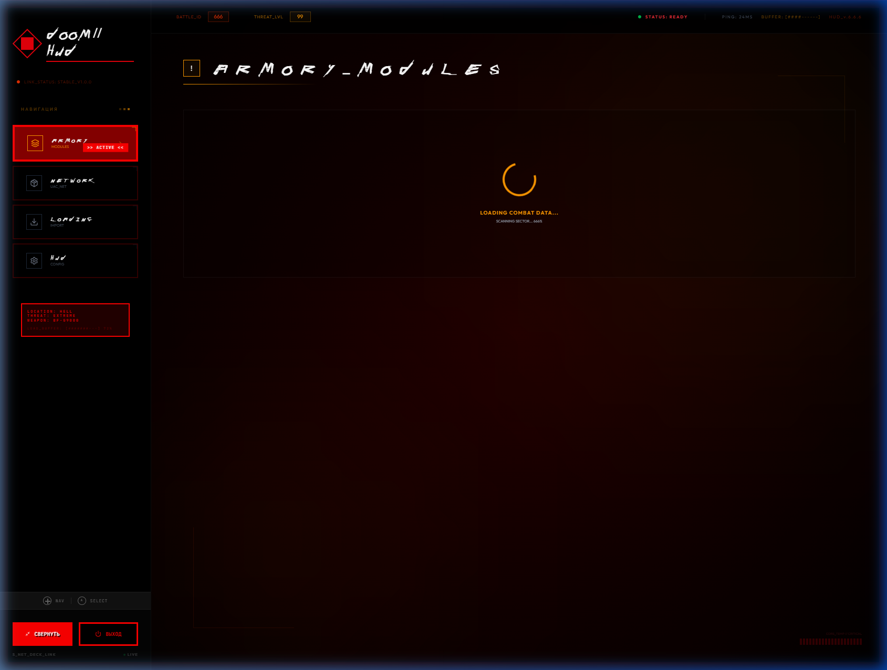
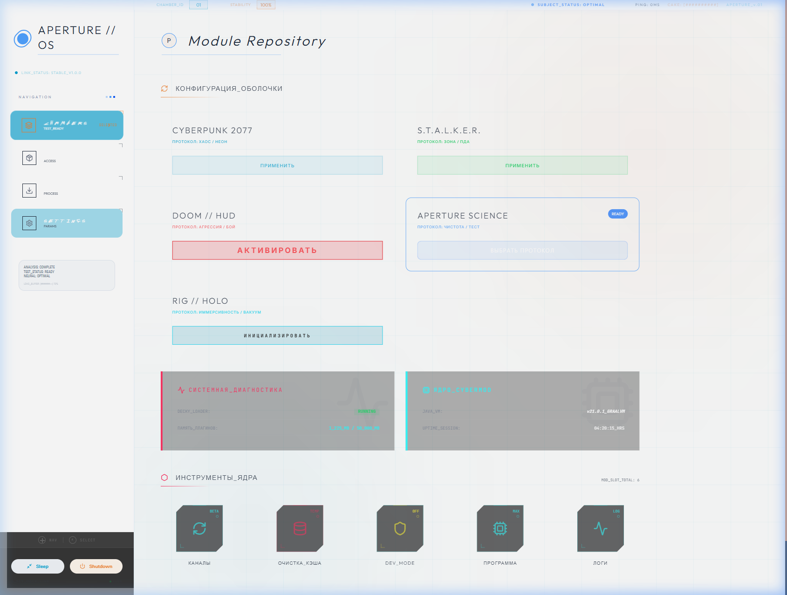
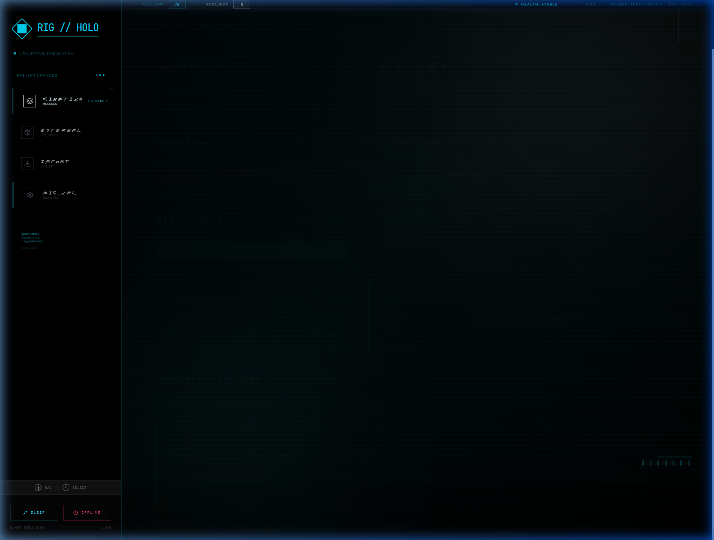

## 🎨 Пакет тем (Multiverse Theme Pack)

CyberMod поддерживает систему динамической смены тем. Каждая тема — это не просто смена цветов, а полная трансформация интерфейса:

1.  **Cyberpunk (Night City)** — Промышленный неон, плотный интерфейс, золотая иерархия. Идеально для тех, кто любит атмосферу хаоса.
2.  **S.T.A.L.K.E.R. (PDA-3)** — Привет из Зоны. Тёмно-зелёный ПДА-интерфейс, шум и каноничные шрифты (**Amaz Stalker**, **Kelly Slab**, **VT323**).
3.  **DOOM (Combat HUD)** — Максимальная агрессия. Каноничный шрифт **AmazDooM**, кроваво-красная палитра и мгновенные ("snap") анимации.
4.  **Portal (Aperture OS)** — Стерильная чистота лаборатории. Оригинальный шрифт **Univers Next Pro**, плавные анимации и минимализм.
5.  **Dead Space (RIG Holo)** — Иммерсивный голографический интерфейс. Шрифты **Eurostile** и **DS-Digital**, эффект "парящих" кнопок.

Переключение происходит мгновенно в меню **Settings** (Конфигурация).

## Особенности обновленной темы Cyberpunk 2077
Мы довели тему до идеала, максимально приблизив её к эстетике Найт-Сити:
- 🎨 **Иерархия цветов**: Главный акцент — **Electric Yellow** (навигация), вспомогательный — **Neon Cyan** (интерактив), **Red** — только критические ошибки.
- 🏗 **Архитектурный шум**: Фон заполнен легкими техно-сетками, circuit-lines и диагностическими блоками, убирая "пустоту" черного пространства.
- 📺 **Диегетический UI**: В интерфейс встроены данные телеметрии (NETWORK PING, THREAT INDEX, NEURAL LINK), создающие ощущение живой системы.
- 🗂 **Многослойность**: Карточки плагинов получили эффект "грязного стекла" и инфо-полосы для лучшей читаемости.
- 🎮 **Панельные кнопки**: Все действия переработаны в "физические панели" с выразительным фокусом для удобства игры на Steam Deck.

## 📸 Галерея тем (Theme Gallery)

| Cyberpunk (Dashboard) | S.T.A.L.K.E.R. (PDA) |
| :--- | :--- |
|  |  |

| DOOM (HUD) | Portal (Aperture) | Dead Space (RIG) |
| :--- | :--- | :--- |
|  |  |  |

---

CyberMod — это мощное автономное приложение для Steam Deck, выполненное в эстетике Cyberpunk 2077. Оно позволяет управлять кастомными модификациями и оригинальными плагинами Decky Loader через единый футуристичный интерфейс.

## Основные возможности
- 🌌 **Premium Cyberpunk UI**: Глубоко проработанный интерфейс с использованием Tailwind, Framer Motion и кастомных шейдеров.
- 🎮 **Steam Deck Optimized**: Навигация адаптирована под геймпад (D-pad/стики) через Gamepad API.
- ⚡ **Java 21 Power**: Высокопроизводительный бэкенд на Java 21 с использованием Virtual Threads.
- 🛠 **Hybrid Catalog**: Поддержка собственных плагинов и интеграция с оригинальным каталогом Decky.
- 📦 **ZIP Installer**: Простая установка плагинов из локальных архивов.
- 🔄 **Auto-Update**: Автоматическая проверка обновлений через GitHub Releases с обновлением в один клик.

## Структура проекта
- `/frontend/src/themes`: Все визуальные стили и ресурсы тем.
- `/backend`: Логика на Java 21, API-сервер на Javalin.
- `/catalog`: Локальные манифесты и метаданные.

## Быстрый старт

### Установка на Steam Deck (release)
```bash
# Загрузите последнюю версию из Releases и установите одной командой:
curl -L https://github.com/YOUR_REPO/releases/latest/download/cybermod-latest-steamdeck.tar.gz | tar xz
chmod +x install.sh && ./install.sh
```
После установки CyberMod работает как systemd-сервис и запускается автоматически.

### Автообновление
CyberMod проверяет наличие обновлений при запуске. Если доступна новая версия — в интерфейсе появится баннер с кнопкой «Обновить». Обновление скачивается из GitHub Releases и применяется автоматически.

### Требования (для разработки)
- JDK 21
- Node.js 18+

### Запуск в режиме разработки

1. **Запуск Backend**:
   ```bash
   cd backend
   mvn compile exec:java -Dexec.mainClass="com.cybermod.App"
   ```
   *Сервер будет доступен на порту 7070.*

2. **Запуск Frontend**:
   ```bash
   cd frontend
   npm install
   npm run dev
   ```
   *Интерфейс откроется в браузере (обычно порт 5173).*

## Дизайн (Cyberpunk 2077)
Тема использует строгую иерархию:
- **Electric Yellow**: `#fcee0a` — Навигация, заголовки, выбор.
- **Neon Cyan**: `#00fbff` — Интеракт, подтверждение, hover.
- **Red/Magenta**: `#ff003c` — Опасность, ошибки, удаление.
- **Cyber Black**: `#050505` — Глубокий фон.

## Repo Activity


---

Разработано специально для использования в Game Mode на Steam Deck.
