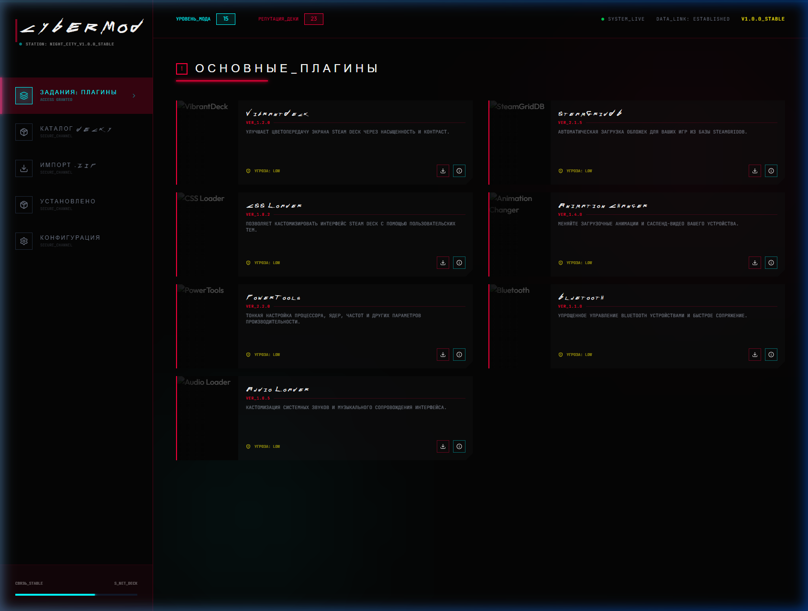
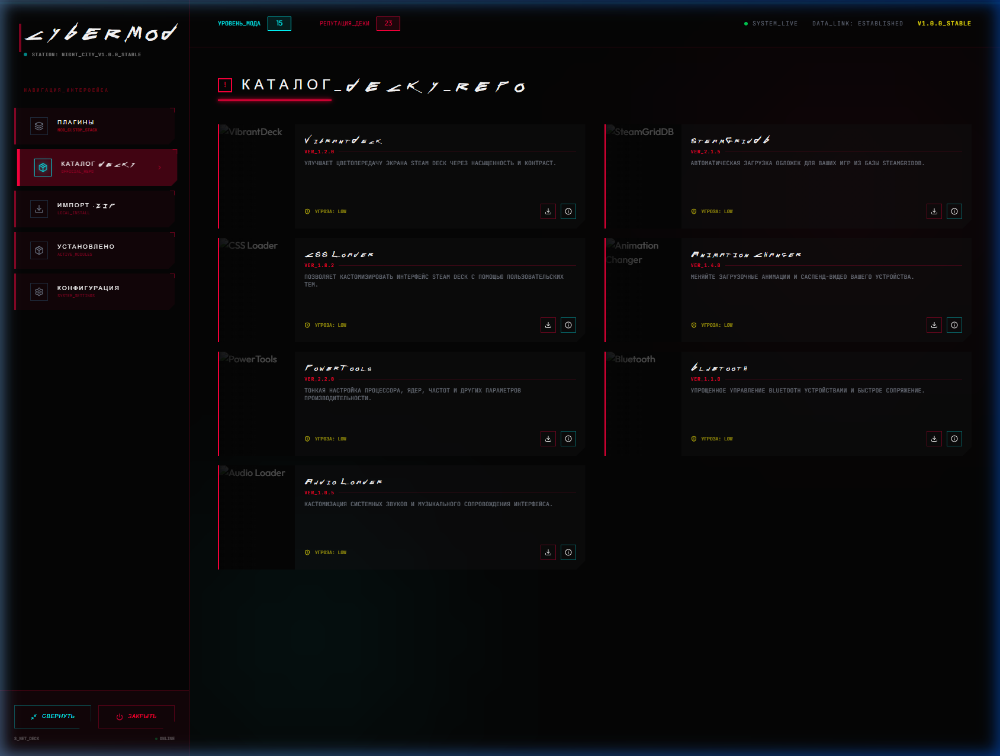

## Система тем (Theming System)

CyberMod поддерживает систему сменяемых тем, в каждой из которых заложен уникальный визуальный язык. Текущая структура папок:
- **Cyberpunk** (Chaos) — Промышленный неон, плотный интерфейс, желтые акценты. [ТЕКУЩАЯ]
- **Stalker** (Realism) — Износ, реализм, выживание. [В РАЗРАБОТКЕ]
- **Doom** (Aggression) — Агрессивный красный, высокая скорость. [В РАЗРАБОТКЕ]
- **Portal** (Pure UX) — Минимализм, чистота, лабораторный стиль. [В РАЗРАБОТКЕ]
- **Dead Space** (Immersive) — Экспериментальный иммерсивный хоррор-UI. [В РАЗРАБОТКЕ]

## Особенности обновленной темы Cyberpunk 2077
Мы довели тему до идеала, максимально приблизив её к эстетике Найт-Сити:
- 🎨 **Иерархия цветов**: Главный акцент — **Electric Yellow** (навигация), вспомогательный — **Neon Cyan** (интерактив), **Red** — только критические ошибки.
- 🏗 **Архитектурный шум**: Фон заполнен легкими техно-сетками, circuit-lines и диагностическими блоками, убирая "пустоту" черного пространства.
- 📺 **Диегетический UI**: В интерфейс встроены данные телеметрии (NETWORK PING, THREAT INDEX, NEURAL LINK), создающие ощущение живой системы.
- 🗂 **Многослойность**: Карточки плагинов получили эффект "грязного стекла" и инфо-полосы для лучшей читаемости.
- 🎮 **Панельные кнопки**: Все действия переработаны в "физические панели" с выразительным фокусом для удобства игры на Steam Deck.

## Интерфейс (Preview)

| Главный дашборд | Сайдбар (Cyberpunk 2077 Premium) |
| :--- | :--- |
|  |  |

---

CyberMod — это мощное автономное приложение для Steam Deck, выполненное в эстетике Cyberpunk 2077. Оно позволяет управлять кастомными модификациями и оригинальными плагинами Decky Loader через единый футуристичный интерфейс.

## Основные возможности
- 🌌 **Premium Cyberpunk UI**: Глубоко проработанный интерфейс с использованием Tailwind, Framer Motion и кастомных шейдеров.
- 🎮 **Steam Deck Optimized**: Навигация адаптирована под геймпад (D-pad/стики) через Gamepad API.
- ⚡ **Java 21 Power**: Высокопроизводительный бэкенд на Java 21 с использованием Virtual Threads.
- 🛠 **Hybrid Catalog**: Поддержка собственных плагинов и интеграция с оригинальным каталогом Decky.
- 📦 **ZIP Installer**: Простая установка плагинов из локальных архивов.

## Структура проекта
- `/frontend/src/themes`: Все визуальные стили и ресурсы тем.
- `/backend`: Логика на Java 21, API-сервер на Javalin.
- `/catalog`: Локальные манифесты и метаданные.

## Быстрый старт

### Требования
- JDK 21
- Node.js 18+

### Запуск в режиме разработки

1. **Запуск Backend**:
   ```bash
   cd backend
   mvn compile exec:java -Dexec.mainClass="com.cybermod.App"
   ```
   *Сервер будет доступен на порту 7070.*

2. **Запуск Frontend**:
   ```bash
   cd frontend
   npm install
   npm run dev
   ```
   *Интерфейс откроется в браузере (обычно порт 5173).*

## Дизайн (Cyberpunk 2077)
Тема использует строгую иерархию:
- **Electric Yellow**: `#fcee0a` — Навигация, заголовки, выбор.
- **Neon Cyan**: `#00fbff` — Интеракт, подтверждение, hover.
- **Red/Magenta**: `#ff003c` — Опасность, ошибки, удаление.
- **Cyber Black**: `#050505` — Глубокий фон.

---
Разработано специально для использования в Game Mode на Steam Deck.
